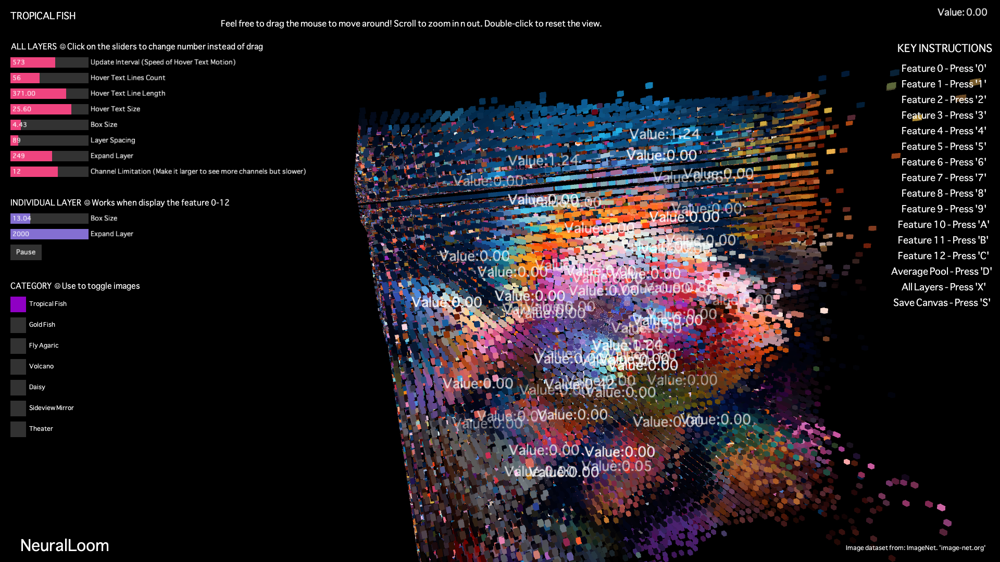

# NeuralLoom

An interactive 3D visualizer for **AlexNet activations**, built with PyTorch and Processing (Java).

Explore intermediate feature maps from seven input images through a layered overview, animated channel views, camera navigation, and adjustable visual parameters. Activation data is exported with PyTorch and loaded from CSV files for visualization.

**Code:** [Processing Java source](NeuralLoom/) · [Main sketch](NeuralLoom/NeuralLoom.pde) · [Activation extraction](scripts/test_imagenet.py)

## Features

- **Layer overview:** arrange 14 stored outputs in 3D space, covering features 0–12 and avgpool.
- **Channel views:** inspect individual layers through fading channel animations.
- **Interactive navigation:** rotate, zoom, reset the camera, and switch input images.
- **Visual controls:** adjust cube size, layer spacing, depth displacement, and hover text effects.
- **Numerical display:** show activation values through hover-triggered text in the overview.

Matrix coordinates determine cube positions, while activation values control depth displacement. Colors are sampled from the input image; view changes trigger sound clips.

## Quick start

1. Install [Processing 4](https://processing.org/download/).
2. Install [ControlP5](https://www.sojamo.de/libraries/controlP5/), [PeasyCam](https://mrfeinberg.com/peasycam/), and [Processing Sound](https://processing.org/reference/libraries/sound/).
3. Download or clone this repository.
4. Open [NeuralLoom/NeuralLoom.pde](NeuralLoom/NeuralLoom.pde) in Processing. This loads all six Java-mode source tabs, which use the `.pde` extension.
5. Keep the `NeuralLoom` folder, its `data` directory, input images, and audio files together, then click **Run**. The sketch opens a full-screen P3D window.

The bundled CSV files are sufficient to run the visualization. PyTorch is needed only to export new activation data.

Recorded dependency versions are ControlP5 2.2.6, PeasyCam 302, and Sound 2.3.1. These are reference versions; environment compatibility has not been retested.

## Controls

| Action | Control |
| --- | --- |
| Navigate the 3D scene | Mouse drag |
| Zoom | Scroll |
| Reset view | Double-click |
| Select features 0–9 | Keys `0`–`9` |
| Select features 10–12 | Keys `A`, `B`, `C` |
| Select avgpool | Key `D` |
| Return to overview | Key `X` |
| Save a screenshot | Key `S` |
| Select an input image | Category buttons |
| Pause channel fading | Pause button |
| Adjust visual parameters | Sliders; click to change their values |

## Data pipeline

The [activation extraction script](scripts/test_imagenet.py) loads a pretrained torchvision AlexNet in evaluation mode. Images are resized to a short edge of 256 pixels, center-cropped to 224 × 224, converted to tensors, and normalized with ImageNet channel statistics.

Recursive forward hooks collect intermediate outputs. Four-dimensional outputs are exported as channel matrices in CSV files, which Processing reads for interactive display.

To export new data, install the packages in [requirements.txt](requirements.txt), set the script's `image_path` to a local RGB image, and run it from a separate output directory. See [the extraction guide](docs/extraction.md) for file naming, category prefixes, and capture behavior.

## Source code

| File | Purpose |
| --- | --- |
| [NeuralLoom.pde](NeuralLoom/NeuralLoom.pde) | Main program, input groups, setup, and 3D overview rendering |
| [GUI.pde](NeuralLoom/GUI.pde) | Interface controls and input image selection |
| [channels.pde](NeuralLoom/channels.pde) | Individual layer rendering and channel animation |
| [load.pde](NeuralLoom/load.pde) | CSV parsing and image-group loading |
| [hover.pde](NeuralLoom/hover.pde) | Numerical hover text and visual effects |
| [keypress.pde](NeuralLoom/keypress.pde) | Keyboard navigation, sound feedback, and screenshots |
| [test_imagenet.py](scripts/test_imagenet.py) | PyTorch AlexNet inference and activation export |

## Known limitations

- The visualization displays precomputed data. Channel animation represents browsing through stored outputs.
- Individual views currently cycle only the first 64 channels in deeper outputs. The overview displays a configurable limit of 1–20 channels per output.
- Hover detection and cube placement use different depth mappings, which can cause misalignment after adjusting visual parameters.
- Color sampling and sound feedback are expressive elements, without quantitative feature-label or audio mappings.
- Model inference and the Processing sketch have not been re-run during repository preparation. The extraction script retains a machine-specific input path that must be changed before use.

See [verification notes](docs/verification.md) for the source and data checks.

## Documentation

- [Input groups and CSV format](docs/data.md)
- [AlexNet activation extraction](docs/extraction.md)
- [Demo video](https://www.youtube.com/watch?v=JiyLM5rSYIQ)
- [Asset credits](docs/credits.md)

## License

No project-wide license has been assigned. Existing source notices and third-party asset attributions are documented in [credits](docs/credits.md).
